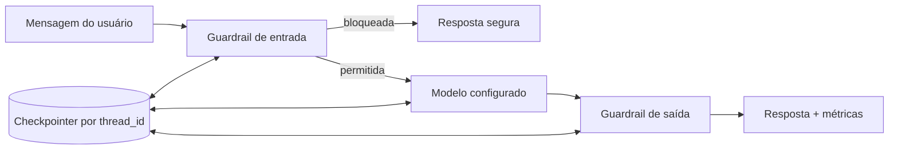

# Arquitetura da Sprint 03

## Framework escolhido

Foi escolhido o **LangGraph**, usando os componentes de mensagens do LangChain.
O framework não aparece apenas como dependência: ele controla o pipeline executado
em cada turno, as rotas condicionais e a memória da sessão.

### Componentes utilizados

- `StateGraph`: define e executa o fluxo conversacional.
- `add_messages`: acumula mensagens sem substituir o histórico.
- `InMemorySaver`: checkpointer que mantém estado por `thread_id` durante a execução.
- arestas condicionais: impedem que entradas bloqueadas cheguem ao modelo.
- `ChatOpenAI`: adaptador usado na comparação final entre dois modelos.
- `ChatGoogleGenerativeAI`: adaptador opcional preservado para extensões futuras.

### Motivos da escolha

1. O LangGraph mantém a arquitetura independente do modelo e permite comparar
   `gpt-4o-mini` e `gpt-5-nano` na mesma interface.
2. A memória por sessão é nativa e identificada pelo `thread_id`.
3. O grafo torna guardrails e decisões de fluxo explícitos e testáveis.
4. O modelo pode ser trocado por configuração, sem alterar regras ou testes.

### Vantagens

- separação entre orquestração, prompt, provedores, segurança e avaliação;
- sessões independentes e testáveis;
- bloqueio determinístico antes da chamada paga ao modelo;
- métricas homogêneas para modelos distintos;
- manutenção mais simples que o notebook monolítico.

### Limitações e trade-offs

- mais dependências e conceitos que o `if/elif` da Sprint 2;
- `InMemorySaver` não mantém dados após encerrar o processo;
- modelos com raciocínio podem consumir o limite de saída sem produzir texto
  visível, como ocorreu com `gpt-5-nano` e 500 tokens;
- guardrails determinísticos são rápidos e auditáveis, mas padrões inéditos podem
  exigir novas regras ou uma camada classificadora adicional;
- respostas sobre produtos continuam limitadas sem uma base oficial de manuais.

## Antes × depois

| Aspecto | Sprint 2 | Sprint 03 |
|---|---|---|
| Fluxo | Função manual com `if/elif` | Grafo com rotas explícitas |
| LLM | Gemini configurado, mas não chamado por `conversar()` | Modelo chamado no nó `model` |
| Memória | Lista usada somente para exportação | Histórico recuperado por `thread_id` |
| Segurança | Somente instrução de escopo no prompt | Guardrails de entrada, prompt e saída |
| Modelos | Um modelo declarado | Dois modelos OpenAI avaliados; adaptador Gemini opcional |
| Avaliação | Rótulo `Adequada` fixo | Critérios reproduzíveis, latência e tokens |

